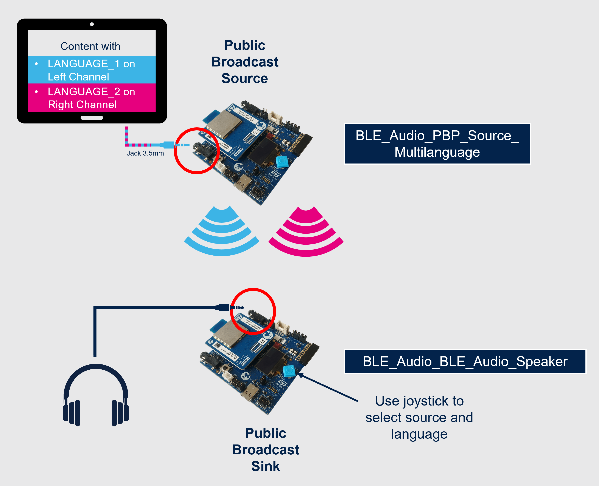
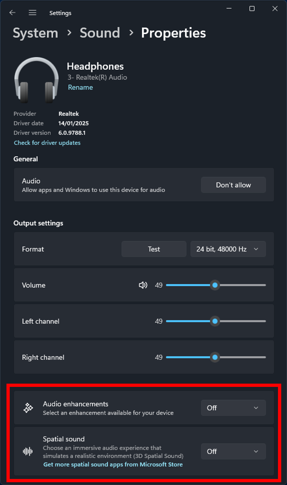
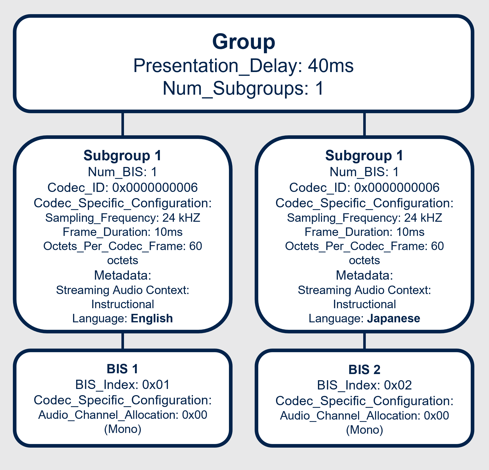

# **BLE_Audio_PBP_Source_Multilanguage Application Description**

This project is based on the BLE_Audio_PBP_Source application available in the [STM32CubeWBA firmware package 1.7.0](https://www.st.com/en/embedded-software/stm32cubewba.html). The major difference from the base application is the modification of the `PBPAPP_SetupBASE` function to create a bilingual BASE structure with two subgroups.

For more details about the Broadcast Source role, refer to the [Basic Audio Profile specification](https://www.bluetooth.com/specifications/specs/basic-audio-profile-1-0-1/).

For more details about the Public Broadcast Profile projects, refer to the [Public Broadcast Profile wiki page](https://wiki.st.com/stm32mcu/wiki/Connectivity:Bluetooth_LE_Audio_-_STM32WBA_Public_Broadcast_Profile).
 

### **Keywords**

Connectivity, BLE, BLE protocol, BLE profile, BLE audio, Auracast

### **Hardware and software environment**
This example is designed to run on **STM32WBA65I-DK1** boards.

To build the project, you need one of the following IDEs:
  - IAR Embedded Workbench for ARM (EWARM) 9.60.3
  - RealView Microcontroller Development Kit (MDK-ARM) 5.38
  - STM32CubeIDE 1.18.1

### **Setup**

To make the program work, follow these steps:

1. Open your preferred toolchain.
2. Rebuild all files and load the image into the target memory.
3. Run the example.

The following figure details a setup example using the BLE_Audio_Broadcast_Speaker project available in this repository as a Broadcast Sink:

### **Operate the demo**

#### Source configuration
 - The PBP Broadcast Name is configurable via the `aPBPAPP_BroadcastName` variable in the pbp_app.c file.
 - The languages streamed are configurable by setting `LANGUAGE_1` and `LANGUAGE_2` in pbp_app.c to any 3-byte lower case code as defined in ISO 639-3. These codes correspond to the left and right channels of the streamed content (see [Input audio requirements](#input-audio-requirements) section)

#### Startup Behavior

At Startup,the PBP Source starts broadcasting the audio stream. The audio is captured through the Jack Connector CN4. The Broadcast Name is then displayed on the LCD interface.

The BLE_Audio_Broadcast_Speaker application can then be used to synchronize to the broadcast audio stream, acting as a Broadcast Sink. The BASE structure of the BLE_Audio_PBP_Source_Multilanguage project indicates to the remote Broadcast Sink that two languages are streamed. The Broadcast Sink can choose which language he wants to synchronize with.

### **Input audio requirements**
This example allows the Broadcast Source to stream in two different languages. This is achieved by using a classic stereo stream from the 3.5mm jack input, with one BIS per channel and declaring the two BISes as different languages. The remote device can synchronize to only one of the two BISes to retrieve the desired language.

Therefore, the audio used as a source must be properly prepared and must contain the first language on the left channel and the second language on the right channel. This can be achieved by using a video editing software on a video with multiple languages tracks, such as a movie or a commercial.

An ST promotional video has been edited such way and is available on YouTube:
 - In English and Japanese: [https://www.youtube.com/watch?v=wDgvC-sPDxo](https://www.youtube.com/watch?v=wDgvC-sPDxo)
 - In English and Mandarin Chinese: [https://www.youtube.com/watch?v=UYlKJH2qSRQ](https://www.youtube.com/watch?v=UYlKJH2qSRQ)

> [!NOTE]
> If the audio channels doesn't seem perfectly dissociated, check your device's parameters and disable any audio processing. For example, on Windows 11, disable "Audio enhancements" and "Spacial sound"
> 

### **Multilanguage BASE structure**
For the Broadcast Source to be recognized as a multilingual Broadcast Source, the BASE structure available in the Periodic Advertising data contains two subgroups. Each of these subgroups includes a "Language" metadata field to indicate which language is contained in the subgroup.

The structure of the BASE used for this project is as follows:

For more details about the BASE structure, refer to the [Stream Management wiki page](https://wiki.st.com/stm32mcu/wiki/Connectivity:Bluetooth_LE_Audio_-_Stream_Management#BASE_Structure) or the [Basic Audio Profile specification](https://www.bluetooth.com/specifications/specs/basic-audio-profile-1-0-1/).

### **Documentation**

   - Wiki pages related to the LE Audio solutions developped by STMicroelectronics are available here:
     - <a href="https://wiki.st.com/stm32mcu/wiki/Connectivity:Introduction_to_Bluetooth_LE_Audio"> Introduction to Bluetooth® Low Energy Audio</a>
	 - <a href="https://wiki.st.com/stm32mcu/wiki/Connectivity:Bluetooth_LE_Audio_-_STM32WBA_LC3_Codec"> Bluetooth® Low Energy audio - STM32WBA LC3 codec and audio data path</a>
     - <a href="https://wiki.st.com/stm32mcu/wiki/Connectivity:Bluetooth_LE_Audio_-_STM32WBA_Architecture_and_Integration"> Bluetooth® Low Energy audio - STM32WBA Architecture and Integration</a>
     - <a href="https://wiki.st.com/stm32mcu/wiki/Connectivity:Bluetooth_LE_Audio_-_Content_Control"> Bluetooth® Low Energy audio - Content Control</a>
     - <a href="https://wiki.st.com/stm32mcu/wiki/Connectivity:Bluetooth_LE_Audio_-_STM32WBA_Public_Broadcast_Profile"> Bluetooth® Low Energy audio - STM32WBA Public broadcast profile</a>

