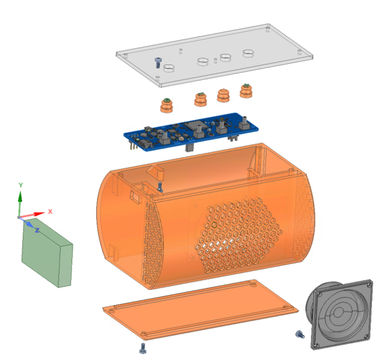
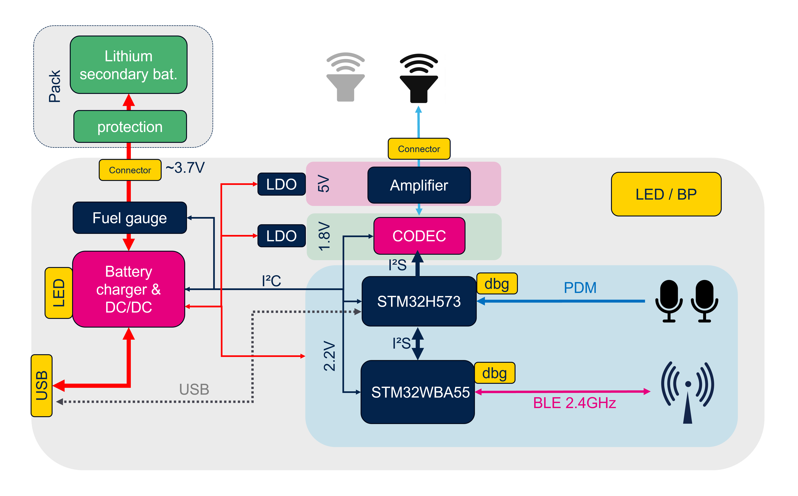
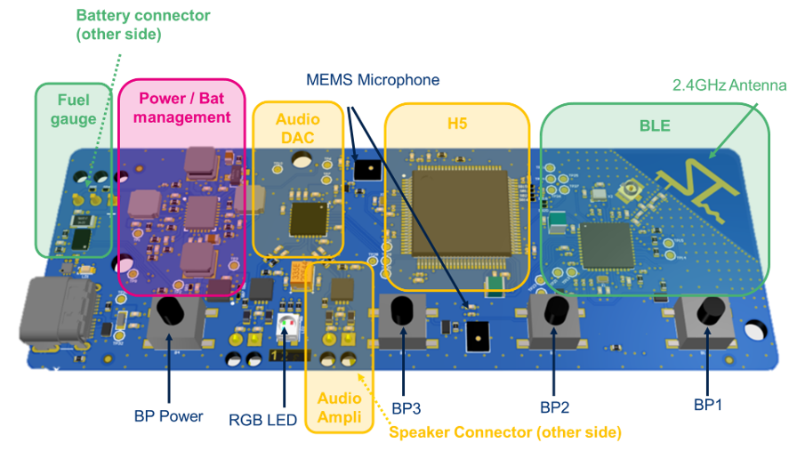
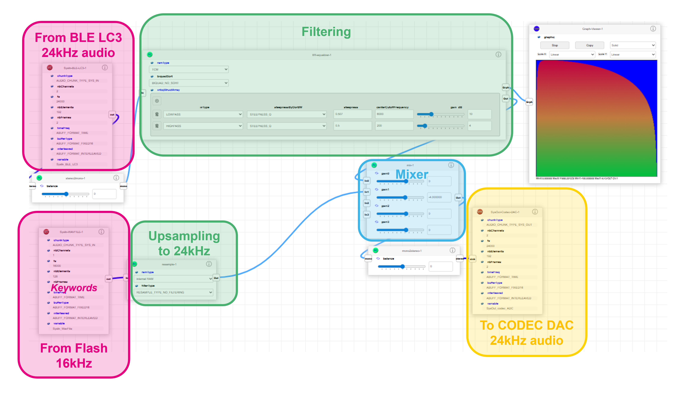
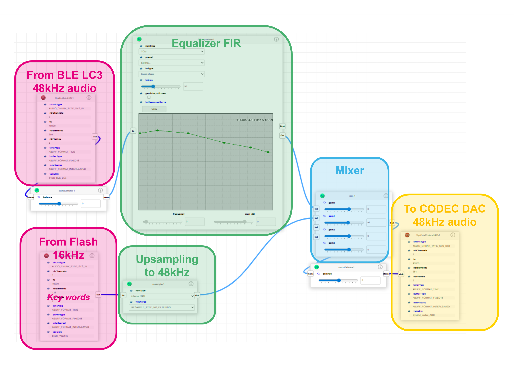

# STM32WBA-Advanced-BLE-Broadcast-Speaker demonstration

The [BLE Speaker](#ble-speaker) is a prototype for a portable Bluetooth&reg; Low Energy speaker supporting **broadcast sink**, **scan delegator role** and optionally unicast server role.
While the Bluetooth&reg; Low Energy communication is handled by an STM32WBA component, an STM32H5 which supports the [Audio-Kit](https://www.st.com/en/embedded-software/x-cube-audio-kit.html) framework, allows to add some functionalities regarding audio processing.

At the front end, audio output is done using a small speaker. A USB-C connector is used for battery charging and tuning of the audio chain. 

This product demonstration takes place in an environment consisting of either [STM32WBA55G-DK](https://www.st.com/en/evaluation-tools/stm32wba55g-dk1.html) or [STM32WBA65I-DK](https://www.st.com/en/evaluation-tools/stm32wba65i-dk1.html) acting as audio broadcasters; an Auracast&reg; source streaming two languages sampled at 24kHz and stereo music sources (48kHz sampling frequency).

Follow this [link](https://youtu.be/Yvg6b6mDONU) for a video showing the interaction between the speaker and broadcast sources. 

Optionally, another development kit can be used as a **broadcast assistant** to select the audio source. 

> [!NOTE] 
> STM32WBA-Advanced-BLE-Broadcast-Speaker project for either STM32WBA55G-DK or STM32WBA65I-DK can be used for replacing the BLE_Speaker board with limited audio processing capabilities, see [package projects](#package-projects) for more information. 
>

## Table of content
* **[Demonstration Setup](#demonstration-setup)**
* **[Package projects](#package-projects)**
* **[BLE Speaker](#ble-speaker)**
  * **[Bill of materials](#bill-of-materials)**
  * **[Product architecture](#product-architecture)**
    * **[Development mode](#development-mode)**
    * **[Release mode](#release-mode)**
  * **[Behavior and features](#behavior-and-features )**
    * **[Human Machine Interface](#human-machine-interface)**
    * **[Announcement feature](#announcement-feature)**
    * **[Audio Graph Management](#audio-graph-management)**
    * **[Algorithm parameters update](#algorithm-parameters-update)**  
  * **[Known Limitations](#known-limitations)**
* **[Keywords](#keywords)**

## Demonstration Setup

### STEP 1 : setup public broadcast sources

* The Auracast&reg; source development-kit must be programmed with the project called BLE_Audio_PBP_Source_MultiLanguage available in this package
  * Before compiling, ensure the broadcast name `aPBPAPP_BroadcastName` is `Public_TV_1`
  * Get the [sample video](https://www.youtube.com/watch?v=wDgvC-sPDxo) where left channel is handling English and right channel is handling Japanese
  * Connect a stereo 3.5mm jack cable on CN4 to the computer audio output and play the video. More information is available in the [README](Projects/STM32WBA55G-DK1/Applications/BLE/BLE_Audio_PBP_Source_MultiLanguage/README.md)

* Stereo music sources firmware can be found for development-kit in the official [STM32CubeWBA package](https://www.st.com/en/embedded-software/stm32cubewba.html) with the BLE_Audio_PBP_Source project. Otherwise, uses binaries from the folder *Utilities/binaries/*
  * Before compiling, change the broadcast name `aPBPAPP_BroadcastName` to either `Music_Player_1` or `Music Player_2`
  * Connect CN4 to a computer or media player using a 3.5mm stereo jack cable

### STEP 2 : setup the speaker 

For reproducing the demonstrator with Livetune and scan delegator capabilities running on the [BLE_Speaker](#ble-speaker), follow the steps below:
* Ensure the BLE_Speaker board is ready with a battery connected and programming probe connected to CN2 (either using pin bed, connector or soldered wires), check *Hardware/* folder for details on polarity and connectors
* Connect an USB-C cable to the board
* Push PB4, **don't release it**
* Program the STM32WBA55
    * Compile and load the STM32WBA55 with the project located in ***Projects/BLE_Speaker/Applications/BLE/BLE_Audio_Broadcast_Speaker/***.  Additional information are available in the [README](Projects/BLE_Speaker/Applications/BLE/BLE_Audio_Broadcast_Speaker/README.md)
    * Ensure the program starts: LED starts blinking
* PB4 can be released
* Connect the probe to CN6
* Program the STM32H573 
    * Load the STM32H573 with the project located in ***Projects/BLE_Speaker/Applications/Livetune/*** in Designer
     configuration (this firmware does not contain any audio graph, use **livetune_and_graph.hex** from the ***Livetune/Bin/*** folder otherwise). More information are available in the [README](Projects/BLE_Speaker/Applications/Livetune/README.md)
* Restart the board using PB4

The speaker is now trying to synchronize the source named *Public_TV_1*, English language. Buttons can be used for switching language, changing source or start the advertising for being connected by the broadcast assistant. More details are available in the [Human Interface Machine](#human-machine-interface) section.

Audio graph of the active configuration can be loaded, tuned or changed using the [Livetune interface](Middlewares/ST/Audio-Kit/livetune.html) after connecting COM port named *STM32 Speaker Livetune*. The ***Projects/BLE_Speaker/Applications/Livetune/Bin*** folder contains the two default audio graphs that could be loaded from either the livetune interface or the programming probe at the reserved address.

### STEP 3 : setup the broadcast assistant (optional)

* The broadcast assistant application is available for development-kit on the [github repository](https://github.com/stm32-hotspot/STM32WBA-BLE-Audio-Broadcast-Assistant), otherwise, binaries for the demonstration are available in *Utilities/binaries/*. After the application has started, use the joystick to the *Scan Sc Deleg* action. The speaker will appear in the list of connectable devices only if the user has started the advertising 
* At the end of the linkup, use *Audio Rec Start* to select an audio source, or *Audio Rec Stop* for stopping the current synchronization

## Package Projects
| Board    | Path    | Project | Target | Description | Feature | IDE |
| -------- | ------- | ------  | ------ | ------ | ------ | ------ |
| BLE_Speaker |/Application/BLE/ | BLE_Audio_Broadcast_Speaker | STM32WBA55	| BLE Speaker application | BLE Synchronizer, scan delegator, (opt Unicast Server) |	IAR9.6, CubeIDE |
| BLE_Speaker |/Application/ | Livetune | STM32H573	| BLE Speaker advanced audio processing |	Livetune, AudioChain |	IAR9.4, CubeIDE |
| STM32WBA65I-DK1	|/Application/BLE/ | BLE_Audio_Broadcast_Speaker	| STM32WBA65	| BLE Speaker substitute | BLE Synchronizer, scan delegator, (opt Unicast Server),   **AudioChain** |	IAR9.6, CubeIDE
| STM32WBA55G-DK1	|/Application/BLE/ | BLE_Audio_Broadcast_Speaker	| STM32WBA55	| BLE Speaker simplified substitute | BLE Synchronizer, scan delegator, (opt Unicast Server) |	IAR9.6, CubeIDE, MDK-ARM
| STM32WBA65I-DK1	|/Application/BLE/ | BLE_Audio_PBP_Source_Multilanguage	| STM32WBA65 |	Multilanguage Source |	BLE Auracast&reg; source | IAR9.6, CubeIDE, MDK-ARM
| STM32WBA55G-DK1	|/Application/BLE/ | BLE_Audio_PBP_Source_Multilanguage	| STM32WBA55 |	Multilanguage Source |	BLE Auracast&reg; source | IAR9.6, CubeIDE, MDK-ARM
 
> [!NOTE] 
> ### Some middleware libraries and drivers are unavailable in this repository
> 
> In this repository, the middleware libraries listed below are **not available** as they are subject to some restrictive license terms requiring the user's approval via a "click thru" procedure.
> * `./Middlewares/ST/STM32_Audio/Addons/PDM`
> * `./Middlewares/ST/STM32_Audio/STM32_AcousticBF_Library`
> 
> If needed, they can be found inside the full firmware package available on our website `st.com` and downloadable from [here](https://www.st.com/en/embedded-software/x-cube-audio-kit.html). You will be prompted to login or to register in case you have no account.
>
> Additionally, the following driver is **not available** as it is subject to some restrictive license terms requiring the user's approval via a "click thru" procedure.
> * `./Drivers/BSP/Components/stc3115`
> If needed, they can be downloaded from [here](https://www.st.com/en/embedded-software/stsw-bat001.html).

## BLE Speaker

### Bill of materials

While software and PCB are stereo ready, the mechanicals drawings are demonstrating a mono only, closed-box speaker. Here are the items required for reproducing this speaker:

| Item    | Reference / detail | Q | 
| -------- | ------- | ------ |
| PCB Speaker revB | dedicated printed board revision B | 1 |
| Battery | 2000mAh 1 cell Li-Ion or Li-po battery with PCM | 1 |
| Speaker | 8 ohms Visaton FRWS speaker | 1 |
| Body | 3D printed parts (4x button, body and bottom cover) | 1 |
| Top cover | 3mm PMMA laser cut | 1 |
| screw for thermoplastic | d 2.5mm, 6mm | 15 |

Note the battery can be 2 or 3 contacts, using 2.54mm pitch connector or soldered. 

Speaker can be either soldered or using 2.54mm pitch connector as well. 

Check [schematics](Hardware/BLE_Speaker/Schematic/BLE_Speaker_Schematic.PDF) for more information regarding solder bridge and configuration.

----
### Product architecture

The BLE Speaker demonstrates the collaboration between the STM32WBA component which ensures the Bluetooth&reg; communication and the STM32H5 which handle audio processing and is easily configurable with Livetune.

Audio output, up to 2W, is delivered to a small speaker through a class-D amplifier. Additionally, two MEMS microphones have been added and are reserved for a future use. Several buttons and an RGB LED are available for user interaction.

This speaker is made for running from a lithium battery and a fuel gauge allows to track battery state. Finally, a USB-C connector allows to recharge the battery and tune the audio chain. 

A specific attention has been given to the component consumption. That's why the previous bloc diagram is showing several voltage domains that are controlled by the firmware:
* 5V (from a boost + LDO) for the audio amplifier that can be disabled or adapted to
* 2.2V (from DC/DC) for the digital domain 
* 1.8V (from 2.2V through an LDO) for the analog part

The BLE speaker uses a dedicated printed board called *PCB Speaker revision B* that has been designed with a view to the manufacturing:

* 4 layers PCB, simple technology (0.15 mm tracks / gaps, 0.2mm holes)
* CMS component on top layer
* Optional programming connectors on bottom layer
* Cost effective BOM

In this architecture, the ST32WBA55 handle the main application and is mastering power supplies, fuel gauge, audio codec and STM32H5 using the I²C bus. 
It is important to notice that the Bluetooth&reg; Isochronous link brings a constraint on the audio data rate, thus, the STM32WBA also outputs the audio master clock to all digital component of the audio chain. 
The STM32H5 is acting as a DSP, meaning it is not handling the application but is receiving commands from the STM32WBA including reset command.

Software provided for STM32WBA and STM32H573 are declined from respectively TMAP peripheral provided in [STM32CubeWBA](https://www.st.com/en/embedded-software/stm32cubewba.html) and Livetune application for STM32H573I-DK provided in [x-cube-audio-kit](https://www.st.com/en/embedded-software/x-cube-audio-kit.html). Please refer to these packages for additional information regarding the software architecture. 

Note that the provided projects are showing two variations: the audio development mode (default) or the release mode. 

----
#### Development mode

The development mode is the default mode of this demonstrator and allows to use the graphical Livetune interface for adding algorithm inside the audio chain as well as tuning existing algorithm with direct update, without the need of reprogramming the memory. 

The computer and the STM32H5 are communicating using a serial interface (either USB VCP or UART). By default, the USB is used and the digital voltage is increased to 3.3V by the STM32WBA55 as required by the hardware.
Audio flows are flashed/loaded to/from reserved sectors of the internal flash memory as described in [audio graph management](#audio-graph-management) section.

No low power is performed, and some terminal commands allow to get value for CPU load and footprints.

----
#### Release mode

In this mode only the Audiochain is kept. Computer communication and Livetune management are removed.

Audio flows and graph description are done directly in C code. 

Low power has been implemented on the STM32H5.

Both project must be re-compiled, check readme files for details. 

----
### Behavior and features 

This section shows the product behavior and features delivered with the current software

----
#### Human Machine Interface

Buttons are generating the following actions: 

|     | Short press | Long press |
| -------- | ------- | ------ |
| BP Power  | sample announcement | Power On/Off* |
| BP3 | Volume - | Switch language |
| BP2 | Mute | Start Advertising for 1min |
| BP1 | Volume + | Switch source (or clear database**)|

*The speaker can be powered up with a long press on BP Power, the hardware will boot and an I²C command is send to the DC/DC for finishing the boot sequence. 
Note the power off is done with the same button, initiating an I²C command. 

**Pushing BP1 during the power on sequence initiate a clear of the database.

State feedback is provided by the RGB LED :

| LED color | ratio | meaning |
| -------- | ------- | ------ |
| Blue blink | 90% On | scanning |
| Blue blink | 10% On | advertising |
| Cian blink | depends on parallel scan | connected |
| Pink fast blink |  | Audio streaming |
| Red | 100% On | Error | 

----
#### Announcement feature

From the AudioChain point of view, Bluetooth&reg; LE and microphone are not the only audio sources; some keywords are stored inside the STM32H5 internal flash memory: "*low battery*", "*advertising*" and so on. 
These keywords are stored in PCM mono, 16bits/sample sampled at 16kHz. 
They can be played whether or not data is received on the radio. The main difference is the clock management; when no data is received over the Bluetooth&reg;, the STM32H5 has to generate a master clock for the codec (DAC) and drive its audio peripheral from its own clock. We use here the local HSI clock, the precision is acceptable for this use case. Note that STM32WBA oversees avoiding conflict on clock generation. 

----
#### Audio Graph Management

Depending on the type of audio source the device is sinking, audio processing may be different: a 48KHz sampled music may need a fine-tuned Equalizer while a 24KHz Auracast&reg; source may only need some basic filtering. Usage of microphone may also depend on use case (CIS with call, or keyword recognition). 

At the boot time, the STM32WBA sends a command, so the STM32H573 initializes only the required audio in/out peripherals and loads the corresponding audio flow:
* 0x081F4000 (16k) : Media mode (audio in/out set to 48kHz, no microphone)
* 0x081F8000 (16k) : Auracast&reg; mode (audio in/out set to 24kHz, no microphone)
* 0x081FC000 (16k) : RFU (could set telephony mode adding microphones)

The Auracast&reg; graph loaded by default is the following, this graph is also used when the system is not synchronized to any audio source but needs to do an announcement.
> [!NOTE]
> Equalizer and filter coefficients provided here only to show the impact of the algorithm by cutting high frequencies. It is up to the user to fine-tune these filters to improve the acoustic feedback. 

For saving power consumption, and since only mono speaker is used, IN/OUT on stereo I²S peripheral are adapted to mono in the graph. 
When synchronized to a 48kHz audio source, the media graph is loaded, changing IN/OUT audio frequency and filter used. 

The release mode needs description of the audio graphs in **audio_chain_generated_code.c** file. From the Livetune interface in developer mode, it is possible to generate the code for a specific audio graph, the user must merge them in this file. Flash dedicated sectors are not used anymore. 

Note the STM32H5 expects, at boot time, to receive an I²C command to choose the graph to be started, thus, it is reset each time the mode change or the stream is stopped.

----
#### Algorithm parameters update

Livetune interface allows to update algorithm parameter in live, so the acoustic feedback is immediate. This powerful feature allows an easy and friendly tuning of the speaker. However, for some cases the algorithm tuning may be required by the embedded application instead of the graphical interface, likely for the digital volume control. 
This speaker demonstrates this dynamic update on the main mixer (see graph above) allowing to reduce the volume on the main path during an announcement. 

----
#### Known limitations

Some instabilities have been observed on the USB VCP link, leading to checksum error when reading embeded audio graph through the HTML interface. In that case, perform a new "Connect" cycle or generate a reset by changing source. 

## Keywords

Connectivity, Bluetooth&reg; Low Energy,  Isochronous, Auracast&reg;, Audio Processing, DSP, Livetune, Audio-kit, AudioChain

## Troubleshooting

**Caution** : Issues and the pull-requests are **not supported** to submit problems or suggestions related to the software delivered in this repository. The STM32WBA-Advanced-BLE-Broadcast-Speaker example is being delivered as-is, and not necessarily supported by ST.

**For any other question** related to the product, the hardware performance or characteristics, the tools, the environment, you can submit it to the **ST Community** on the STM32 MCUs related [page](https://community.st.com/s/topic/0TO0X000000BSqSWAW/stm32-mcus).
